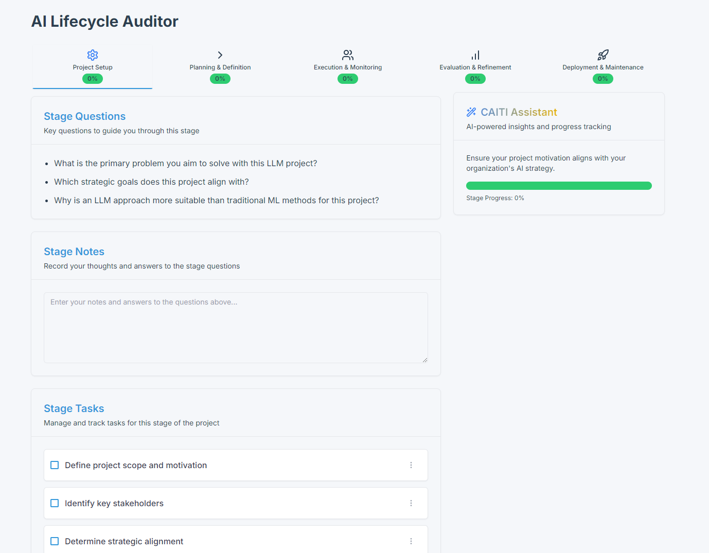

# Responsible AI Checklist CLI

[](https://badge.fury.io/py/rai-checklist-cli)
[](https://opensource.org/licenses/MIT)
[](https://pypi.org/project/rai-checklist-cli)

A command-line tool to easily add customizable responsible AI checklists to data science, Generative AI, or traditional machine learning projects. This tool helps ensure that AI projects adhere to ethical guidelines and best practices throughout their lifecycle. 

This CLI compliments the RAI Auditor UI currently in development.




## Table of Contents

- [Features](#features)
- [Installation](#installation)
- [Usage](#usage)
- [Examples](#examples)
- [Checklist Sections](#checklist-sections)
- [Customization](#customization)
- [Contributing](#contributing)
- [License](#license)

## Features

- Generate customizable AI responsibility checklists
- Support for various output formats (.md, .html, .ipynb)
- Easily integrate into existing projects or create standalone checklists
- Customizable checklist sections

## Installation

Install the Responsible AI Checklist CLI using pip:

```bash
pip install rai-checklist-cli
```

## Usage

The basic syntax for using the CLI is:

```
caiticli [OPTIONS]
```

Options:

- `--help`: Show help message and exit
- `-w, --overwrite`: Overwrite existing output file
- `-o, --output PATH`: Specify output file path
- `-f, --format TEXT`: Specify output format (md, html, ipynb)
- `-l, --checklist PATH`: Path to custom checklist file

## Example

Generate a markdown checklist:

```
caiticli -o checklist.md -f md
```


## Checklist Sections

The default checklist includes the following sections:

- Project Motivation
- Problem Definition
- Performance Measurement
- LLM-Specific Evaluation Metrics
- Ethical Considerations
- Roadmap/Timeline
- Contacts/Stakeholders
- Collaboration
- User Research Aspects
- End User Definition
- End User Testing
- Deployment and Monitoring
- Continual Improvement

## Customization

You can customize the checklist by creating a YAML file with your desired sections and items. Use the `-l` or `--checklist` option to specify your custom checklist file when running the CLI.

For more information on creating custom checklists, please refer to the [documentation](https://github.com/::GITHUB_USERNAME::/rai-checklist-cli/wiki/Custom-Checklists).

## Contributing

Contributions are welcome! Here's how you can contribute to the project:

1. Fork the repository
2. Create a new branch (`git checkout -b feature/your-feature-name`)
3. Make your changes
4. Commit your changes (`git commit -am 'Add some feature'`)
5. Push to the branch (`git push origin feature/your-feature-name`)
6. Create a new Pull Request

Please make sure to update tests as appropriate and adhere to the [code of conduct](CODE_OF_CONDUCT.md).

## License

This project is licensed under the MIT License - see the [LICENSE](LICENSE) file for details.

## Acknowledgments

This project was inspired by and builds upon the work of several existing tools and individuals:

* [Deon](https://deon.drivendata.org/) by [DrivenData](https://www.drivendata.org/): An ethics checklist for data scientists.
* [CAITI AI Risk Library](https://github.com/byteanatom/caiti-ai-risk-library) by ByteanAtom Research: A comprehensive library for AI risk assessment.

### Contributors

* [Noble Ackerson](https://www.linkedin.com/in/noblea) : Project lead and main contributor.

We're grateful for the open-source community and the valuable resources that have made this project possible.

---

**Note:** This project is currently in development. Features and documentation may be incomplete or subject to change.

TODO:
- [ ] Complete the documentation for custom checklists
- [ ] Add more examples and use cases
- [ ] Include frontend-UI (see screenshot)
- [ ] Set up continuous integration and testing
- [ ] Add detailed contribution guidelines